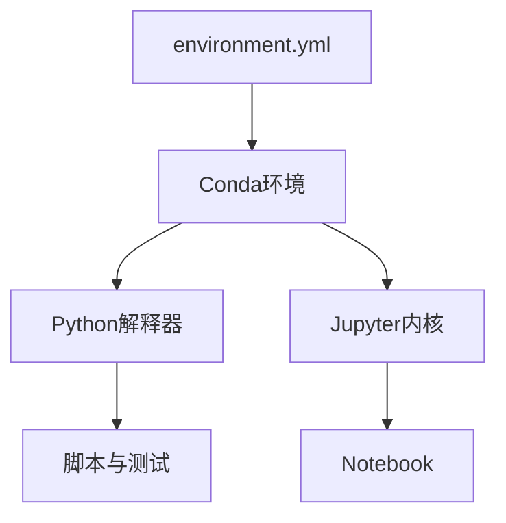

## 可重复、可复现与计算环境

可靠的计算研究需要区分运行环境、分析过程和证据复核。软件安装成功只是起点；版本、随机性、文件路径和自动化方式都会影响同一代码能否再次产生相同结果。

### 可重复性、可复现性与复制

术语在不同学科中存在差异，本书采用以下约定：**可重复性**指使用相同数据、代码和环境得到相同结果；**可复现性**指独立研究者依据公开方法和数据处理说明重建主要结果；**复制研究**进一步使用新样本、地区或时期检验结论。三者形成逐渐增强的证据要求。

计算环境应记录操作系统、Python版本、包版本和系统依赖。`environment.yml`描述Conda依赖，锁定文件可以进一步固定精确版本。容器将系统库和运行命令一并封装，适合自动发布与长期归档；ArcGIS Pro涉及授权和专有依赖时，还需记录软件版本、工具参数和项目包。

### 解释器、环境、内核与依赖管理

**解释器**执行Python代码；**环境**保存特定解释器与软件包集合；**Jupyter内核**把Notebook连接到一个环境；VS Code中选择的解释器与Notebook右上角内核需要指向同一环境。依赖管理解决“需要哪些包及版本”，环境隔离解决“不同项目怎样互不干扰”。



### 随机性、确定性与随机种子

抽样、交叉验证、聚类和机器学习经常包含随机过程。设置**随机种子**可以重现伪随机序列，但不能保证所有硬件、线程和库版本完全确定。研究代码应在NumPy、scikit-learn和其他算法入口显式设置 `random_state`，记录并行参数，并通过测试允许合理数值容差。

```{python filename="scripts/reproducible_randomness.py"}
import numpy as np
from sklearn.model_selection import KFold

SEED = 20260824
rng = np.random.default_rng(SEED)
folds = KFold(n_splits=5, shuffle=True, random_state=SEED)
```

### 文学化编程与研究叙事

**文学化编程**（literate programming）把解释、代码和结果按推理顺序组织。Notebook和Quarto适合展示分析故事，模块化脚本适合测试和重复运行。成熟项目通常将探索保留在Notebook，将稳定函数放入 `src/` 或 `scripts/`，再由Quarto调用成品表格和图件。

代码块之前说明目的和输入，之后解释输出与限制。这样形成的页面既可阅读，也能作为运行入口。隐藏关键清洗步骤会破坏数据血缘，即使模型代码完整，读者仍无法复现结果。

### 持续集成与自动检查

**持续集成**（continuous integration, CI）在每次提交后自动执行环境检查、单元测试、数据契约和Quarto构建。它无法证明研究结论正确，却能及时发现路径失效、字段变化、语法错误和页面断链。教材的GitHub Actions属于这一层基础设施。

计算研究中可重复性与证据透明度的基本论述可参见 [@peng2011reproducible]。

::: {.concept-card}
**最小可重复包**包括：版本化数据或下载脚本、环境文件、固定入口、随机种子、自动检查、生成图表的代码、README和许可。研究者还需解释人工判断与不可公开数据的替代验证方式。
:::
