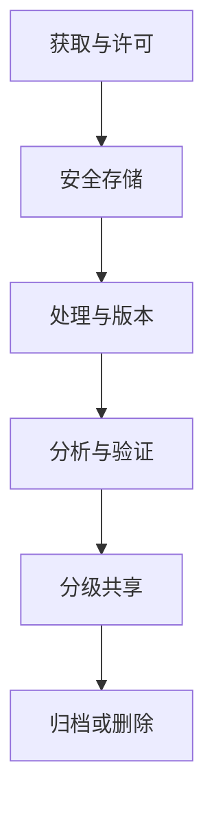

## 研究透明度、复制与伦理治理

综合项目既要完成分析，也要形成可供复查和继续使用的研究产品。开放材料、预先设计、数据管理和同行评议共同决定项目能否成为累积知识。

### 预注册与分析计划

**预注册**在查看主要结果前记录研究问题、假设、样本、变量、排除规则、模型和主要检验。它有助于区分确认性与探索性分析，减少结果导向的规则调整。城市研究中的数据和边界经常变化，预注册可以允许有理由的偏离，但所有偏离需要记录时间、原因和对结论的影响。

课程项目可以使用简化分析计划：主张、估计对象、数据版本、空间单元、主要模型、验证策略、敏感性方案和停止规则。探索性项目同样可以预先说明搜索范围与确认数据。

### 可重复、可复现与复制研究

可重复审查使用相同材料重跑；可复现审查依据说明独立重建；**复制研究**使用新城市、新时期或新数据检验主张。成功重跑说明计算链完整，无法保证测量与机制正确；跨城市复制更能检验外部效度，同时需要解释制度与数据差异。

综合项目的复现包应包含固定入口、环境、数据清单、自动检查和期望输出。受限数据可提供合成样本、字段契约与在安全环境中运行的验证记录。

### FAIR与数据管理计划

**数据管理计划**（DMP）说明数据怎样获取、命名、存储、备份、共享、归档和删除。它还需规定个人数据的法律基础、访问角色、脱敏、保留期限与事件响应。FAIR原则帮助未来研究者发现和复用材料，隐私与安全要求决定开放层级。

### 同行评议与红队审查

同行评议检查问题、设计、数据、方法和陈述。**红队审查**主动寻找项目失效方式，例如边界改变、缺失集中、空间泄漏、替代指标和错误用途。有效评议提出可执行检查，并区分致命问题、主要修改和表达改进。

复现者应记录环境、运行步骤、差异和无法完成的原因，避免只给“可以/不可以复现”的结论。作者随后把问题转化为测试、文档或限制说明。

### 研究伦理与公共责任

城市数据可能涉及轨迹、家庭位置、脆弱群体、设施安全和平台行为。研究伦理包括知情与合法性、最小必要、群体伤害、偏差、公平、申诉和结果滥用。公开聚合数据也可能在小样本地区暴露个体或污名化社区。

伦理审查应贯穿数据生命周期。项目结束时给出允许用途、禁止用途、联系人、更新周期和撤回机制，使研究成果在离开课程后仍有清楚责任边界。

开放数据管理与预注册的核心原则可参见 [@wilkinson2016fair; @nosek2018preregistration]。

::: {.concept-card}
**综合项目的成熟标志**：主问题清晰、估计对象明确、数据有谱系、代码可运行、结果经空间验证、结论匹配证据、材料按许可共享、敏感对象得到保护、他人能够提出并执行复核。
:::
