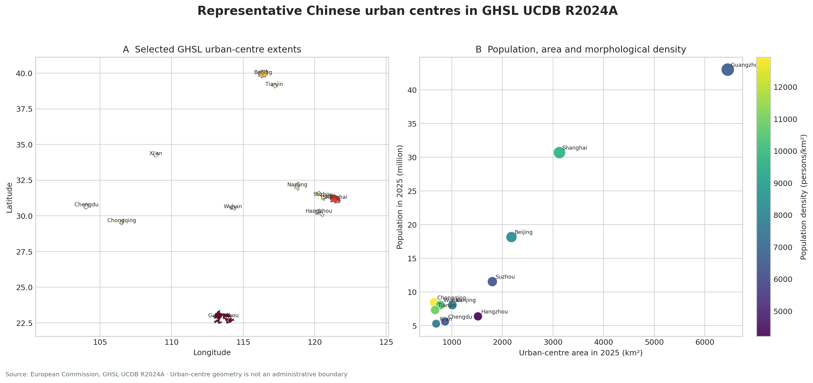

# GHSL 中国代表性城市形态区 {.unnumbered}

## 数据来源与分析对象 {.unnumbered}

全球人类住区图层（Global Human Settlement Layer, GHSL）由欧盟委员会联合研究中心维护。教材选取 Urban Centre Database R2024A 中的11个中国城市形态区，保存其几何、2025年人口与面积，以及1990—2020年若干社会经济指标。文件体量较小，适合直接进入 GeoPandas、ArcGIS Pro 和机器学习工作流。

GHSL 的 urban centre 依据连续建成环境与人口密度识别。它为跨城市比较提供统一口径，同时与中国行政区统计口径存在差异。教材中的“北京”“南京”“广州”等名称指 GHSL 城市形态区标签。以广州要素为例，其经度范围延伸至约114.40°E、纬度范围延伸至约22.45°N，覆盖珠三角连续城市化区域的一部分，因此不能直接与广州市行政区总量对照。

## 下载与许可 {.unnumbered}

- [下载 GeoJSON：含11个城市形态区几何与指标](../data/china_city_open/ghsl_china_major_cities.geojson)
- [下载 CSV：含相同属性与地图标注坐标](../data/china_city_open/ghsl_china_major_cities.csv)
- [查看机器可读元数据](../data/china_city_open/metadata.json)
- [GHSL Urban Centre Database R2024A 官方页面](https://human-settlement.emergency.copernicus.eu/ghs_ucdb_2024.php)

使用数据和结果图时应署名 European Commission, Joint Research Centre (JRC), GHSL UCDB R2024A，并查阅下载包中的完整使用说明。教材保存的是官方服务中11条记录的教学子集，原始全球数据库仍以官方发布为准。

## 字段字典 {.unnumbered}

| 字段 | 含义 | 单位/年份 |
|---|---|---|
| `uc_id` | GHSL 城市形态区唯一编号 | 整数 |
| `city_name_en`, `city_name_zh` | 英文标签与教材中文标签 | 文本 |
| `urban_area_km2_2025` | 城市形态区面积 | km²，2025 |
| `population_2025` | 城市形态区人口 | 人，2025 |
| `population_density_km2_2025` | 人口除以城市形态区面积 | 人/km²，2025 |
| `gdp_average_ppp_*` | 数据库给出的平均GDP（PPP）指标 | 1990/2000/2010/2020 |
| `gdp_total_ppp_*` | 数据库给出的GDP总量（PPP）指标 | 1990/2000/2010/2020 |
| `hdi_*` | 人类发展指数 | 1990/2000/2010/2020 |

跨年分析前应回到 GHSL 数据字典核对指标方法、价格口径和缺失值编码。教材保留原始字段的年份，并未把不同年份指标自动折算为可直接比较的增长率。

## 第一步：读取与建立数据概况 {.unnumbered}

```{python filename="notebooks/ghsl_01_read.py"}
from pathlib import Path

import geopandas as gpd
import pandas as pd

path = Path("data/china_city_open/ghsl_china_major_cities.geojson")
cities = gpd.read_file(path)

# 一行对应一个GHSL城市形态区
print(cities.shape)
print(cities.crs)
print(cities.geom_type.value_counts())
print(cities[["city_name_zh", "population_2025", "urban_area_km2_2025"]])
```

预期结果为11行，几何类型为 Polygon 或 MultiPolygon，坐标参考系为经纬度 WGS 84/CRS84。GeoJSON 的经纬度适合交换和网页展示；面积计算应使用数据表中 GHSL 提供的 `urban_area_km2_2025`，或将几何投影到合适的等积坐标系后重新计算。

## 第二步：检查唯一性、缺失值与几何 {.unnumbered}

```{python filename="notebooks/ghsl_02_audit.py"}
# 唯一编号、空值与几何有效性是最基本的质量检查
assert cities["uc_id"].is_unique

audit = pd.DataFrame({
    "missing": cities.isna().sum(),
    "dtype": cities.dtypes.astype(str),
})
print(audit.query("missing > 0"))
print(cities.geometry.is_valid.value_counts())

# 检查城市形态区人口与面积是否为正值
assert cities["population_2025"].gt(0).all()
assert cities["urban_area_km2_2025"].gt(0).all()
```

几何有效并不意味着统计口径适合当前问题。若研究对象是“市域公共服务财政支出”，行政边界更贴近制度范围；若研究对象是“连续建成区的人口密度与扩张”，GHSL 城市形态区更容易在城市之间保持一致。

## 第三步：重新计算并核对人口密度 {.unnumbered}

派生变量应保留计算式、输入字段和单位。这里用2025年人口除以2025年城市形态区面积，得到形态密度。

$$
D_i=\frac{P_{i,2025}}{A_{i,2025}}
$$

其中 $D_i$ 为城市形态区 $i$ 的人口密度，$P$ 为人口，$A$ 为平方千米面积。

```{python filename="notebooks/ghsl_03_density.py"}
cities["density_check"] = (
    cities["population_2025"] / cities["urban_area_km2_2025"]
)

# 教材文件保存到小数点后两位，允许极小的舍入差
max_error = (
    cities["density_check"]
    - cities["population_density_km2_2025"]
).abs().max()
assert max_error < 0.02

ranking = (
    cities[["city_name_zh", "population_2025", "urban_area_km2_2025", "density_check"]]
    .sort_values("density_check", ascending=False)
)
print(ranking.to_string(index=False))
```

密度排名不能独立代表紧凑程度或规划绩效。形态区识别阈值、地形、水体、城市群连续性和通勤范围都会影响分母。解释时应同时查看几何轮廓、人口、面积和识别规则。

## 第四步：绘制真实 GIS 输出 {.unnumbered}

```{python filename="notebooks/ghsl_04_map.py"}
import matplotlib.pyplot as plt

fig, ax = plt.subplots(figsize=(10, 7))
cities.plot(
    column="population_2025",
    cmap="YlOrRd",
    edgecolor="#334e5c",
    linewidth=0.5,
    legend=True,
    legend_kwds={"label": "2025年城市形态区人口"},
    ax=ax,
)

# representative_point 通常比几何质心更容易落在多边形内部
labels = cities.geometry.representative_point()
for x, y, name in zip(labels.x, labels.y, cities["city_name_zh"]):
    ax.text(x, y, name.split("（")[0], fontsize=8, ha="center")

ax.set_title("GHSL 中国代表性城市形态区")
ax.set_axis_off()
fig.tight_layout()
plt.show()
```

{fig-alt="左图为11个中国GHSL城市形态区的位置和轮廓，右图为人口、面积与密度的关系"}

右图显示广州标签对应的连续城市形态区面积和人口显著高于其他样本。该点首先提示空间单元口径差异，随后才进入城市规模解释。上海与北京也处于较大人口和面积区间；成都、西安、武汉、南京、重庆等形成另一组规模相近但密度不同的城市形态区。样本只有11个城市，图中关系适合提出问题，不适合推断全国城市的一般规律。

## 第五步：比较人口、面积与密度 {.unnumbered}

```{python filename="notebooks/ghsl_05_compare.py"}
import seaborn as sns

plot_data = cities.assign(
    population_million=cities["population_2025"] / 1_000_000
)

ax = sns.scatterplot(
    data=plot_data,
    x="urban_area_km2_2025",
    y="population_million",
    hue="population_density_km2_2025",
    size="population_million",
    sizes=(60, 400),
    palette="viridis",
)
ax.set(
    xlabel="城市形态区面积（km²）",
    ylabel="城市形态区人口（百万人）",
    title="人口规模、形态面积与密度",
)
```

面积和人口都随城市规模增加，因此二者的正相关并不意外。密度颜色提供第三个维度：具有相似人口的城市可能占用不同大小的连续城市空间。进一步研究可以加入地形约束、路网连通、建设用地结构和多中心性指标。

## 第六步：构造跨年指标并保留时间口径 {.unnumbered}

```{python filename="notebooks/ghsl_06_change.py"}
import numpy as np

# 采用对数差描述GDP总量变化；先排除非正值和缺失值
valid = cities[
    cities["gdp_total_ppp_1990"].gt(0)
    & cities["gdp_total_ppp_2020"].gt(0)
].copy()

valid["log_gdp_change_1990_2020"] = (
    np.log(valid["gdp_total_ppp_2020"])
    - np.log(valid["gdp_total_ppp_1990"])
)

valid[
    ["city_name_zh", "log_gdp_change_1990_2020", "hdi_1990", "hdi_2020"]
].sort_values("log_gdp_change_1990_2020", ascending=False)
```

跨年总量来自相同数据库，但仍需确认价格、购买力平价、空间边界和插值方法是否一致。若边界随年份变化，总量变化可能同时包含真实增长与空间单元变化。研究报告应说明采用的是数据库提供的统一城市形态区指标还是逐年边界指标。

## 第七步：保存分析成品 {.unnumbered}

```{python filename="scripts/prepare_ghsl_case.py"}
from pathlib import Path

output_dir = Path("data/processed")
output_dir.mkdir(parents=True, exist_ok=True)

fields = [
    "uc_id",
    "city_name_zh",
    "population_2025",
    "urban_area_km2_2025",
    "population_density_km2_2025",
    "geometry",
]
cities[fields].to_file(
    output_dir / "ghsl_major_cities.gpkg",
    layer="urban_centres",
    driver="GPKG",
)
```

GeoPackage 能保存字段类型、坐标系和多个图层，比 Shapefile 更适合课程项目。写出后应重新读取一次，检查记录数、字段、坐标系和几何类型。

## 延伸练习 {.unnumbered}

1. 将11个城市按人口密度分为三组，比较等距、分位数和自然断点分类对地图的影响。
2. 使用 `gdp_total_ppp_2020` 与 `population_2025` 构造近似人均指标，并说明年份不一致造成的限制。
3. 分别保留和暂时排除广州形态区，比较面积—人口回归斜率与残差变化。
4. 从 GHSL 全球数据库增加5个亚洲城市，检查当前11城样本结论是否稳定。
5. 为同一城市获取行政边界，计算行政区与GHSL形态区的面积差，并解释两种单元适用的研究问题。

## 数据复现 {.unnumbered}

教材子集由 `scripts/build_open_city_datasets.py` 访问 GHSL ArcGIS Feature Service 生成。脚本以 `uc_id` 固定选择记录，统一字段名，计算形态密度，写出 GeoJSON、CSV、元数据和结果图。官方服务字段发生变化时，脚本会在读取阶段失败，更新者应重新核对数据字典，不能静默替换语义不同的字段。
