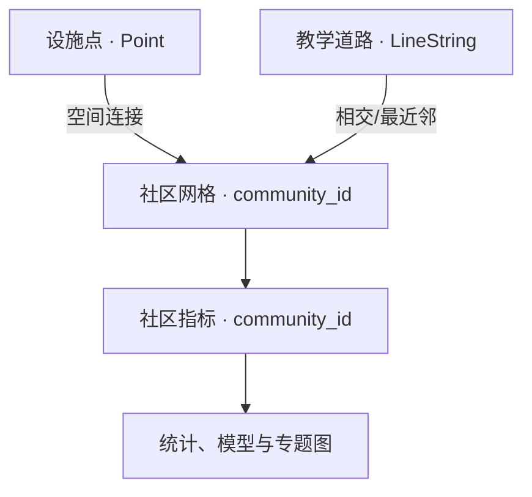
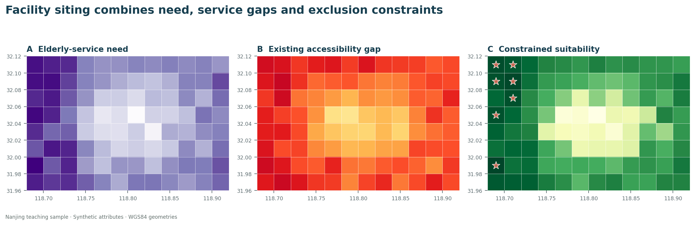

# 南京生活圈教学数据 {.unnumbered}

## 数据定位 {.unnumbered}

南京生活圈教学包为全书提供一组结构稳定、能够在不同软件中重复运行的数据。几何范围位于南京中心城区附近，网格、指标、设施和道路可以完成空间连接、专题制图、空间自相关、网络分析、机器学习和综合规划练习。社区属性、设施类型与道路记录由固定随机种子生成，不能用于评价南京真实社区或公共服务现状。

生成式教学数据有明确用途。教师可以提前验证每一步输出，学生遇到错误时也能区分代码问题和原始数据问题；不同班级使用相同记录，便于讨论参数选择对结果的影响。进入独立研究阶段后，应把字段契约和分析管线迁移到经授权的真实数据。

## 下载文件 {.unnumbered}

| 文件 | 记录数 | 几何/表格 | 主要内容 |
|---|---:|---|---|
| [community_grid.geojson](../data/nanjing_teaching/community_grid.geojson) | 96 | Polygon | 规则社区网格与唯一编号 |
| [community_indicators.csv](../data/nanjing_teaching/community_indicators.csv) | 96 | CSV | 人口、老龄化、温度、绿量、收入、设施与步行指标 |
| [facilities.geojson](../data/nanjing_teaching/facilities.geojson) | 36 | Point | 医疗、教育、养老、文化与体育教学设施 |
| [teaching_roads.geojson](../data/nanjing_teaching/teaching_roads.geojson) | 10 | LineString | 南北向与东西向教学道路 |
| [metadata.json](../data/nanjing_teaching/metadata.json) | — | JSON | 坐标系、范围、生成方法与适用边界 |

## 表之间怎样连接 {.unnumbered}

`community_grid.geojson` 与 `community_indicators.csv` 通过 `community_id` 一对一连接。设施点没有预先写入社区编号，学生需通过空间连接判断其落入哪个网格。道路与网格之间为多对多空间关系：一条道路可能穿过多个网格，一个网格也可能与多条道路相交。



## 第一次读取与检查 {.unnumbered}

从仓库根目录启动 VS Code 或 Jupyter，当前工作目录即可稳定解析下面的相对路径。先读取空间文件，再读取属性表；连接前验证键值唯一性。

```{python filename="notebooks/01_load_nanjing_teaching.py"}
from pathlib import Path

import geopandas as gpd
import pandas as pd

data_dir = Path("data/nanjing_teaching")

# 读取三个空间图层和一个普通表格
grid = gpd.read_file(data_dir / "community_grid.geojson")
facilities = gpd.read_file(data_dir / "facilities.geojson")
roads = gpd.read_file(data_dir / "teaching_roads.geojson")
indicators = pd.read_csv(data_dir / "community_indicators.csv")

# 键值检查应在连接之前完成
assert grid["community_id"].is_unique
assert indicators["community_id"].is_unique
assert set(grid["community_id"]) == set(indicators["community_id"])

print(grid.shape, facilities.shape, roads.shape, indicators.shape)
print(grid.crs)
print(indicators.dtypes)
```

预期记录数依次为 96、36、10 和 96，空间图层坐标参考系为 WGS 84。若记录数不同，应先确认文件版本和读取路径；若 `community_id` 不唯一，一对一连接会复制记录，后续统计量也会随之改变。

## 建立社区分析表 {.unnumbered}

GeoJSON 网格只保存稳定的空间标识和几何，变化较多的研究指标保存在 CSV 中。这样的分离方式减少几何复制，也便于教师替换属性情景。连接时使用 `validate="one_to_one"`，让 Pandas 主动检查关系类型。

```{python filename="notebooks/02_join_indicators.py"}
# 把指标连接到网格；validate 会阻止意外的一对多复制
communities = grid.merge(
    indicators,
    on="community_id",
    how="left",
    validate="one_to_one",
)

# 连接后仍需检查缺失和记录数
assert len(communities) == len(grid)
assert communities[indicators.columns].isna().sum().sum() == 0

communities[[
    "community_id",
    "population",
    "older_share",
    "lst_day_c",
    "ndvi",
    "walkability",
]].head()
```

## 字段阅读方法 {.unnumbered}

| 字段组 | 代表字段 | 单位或范围 | 阅读提示 |
|---|---|---|---|
| 人口与脆弱性 | `population`, `older_share` | 人；0—1 | 人口规模与人口结构应分开解释 |
| 热环境 | `lst_day_c`, `heat_risk` | 摄氏度；标准化指数 | 地表温度不等同于人体热暴露 |
| 绿色环境 | `ndvi`, `green_ratio` | 0—1 | 两者相关，但测量对象不同 |
| 社会经济 | `income_index` | 教学指数 | 只表达相对差异，不对应官方收入金额 |
| 公共服务 | `facility_count`, `service_access` | 个；教学指数 | 数量与可达性不能相互替代 |
| 步行环境 | `walkability` | 教学指数 | 综合变量应追溯构成字段和权重 |

任何复合指数都需要保留组成变量。若只把 `heat_risk` 放入模型，学生难以判断高值来自较高温度、较少绿量、较多老年人口，还是指数权重设置。探索阶段可同时查看原始变量、标准化变量和最终指数。

## 设施点的空间连接 {.unnumbered}

点落面连接需要统一坐标参考系。当前两个图层均为 WGS 84，可以完成拓扑判断；涉及长度、面积和缓冲区时应转换到适合南京的投影坐标系，例如 CGCS2000 高斯—克吕格分带或教学中使用的 UTM 50N（EPSG:32650）。

```{python filename="notebooks/03_facility_join.py"}
# predicate="within" 表示设施点必须位于网格内部
facility_grid = gpd.sjoin(
    facilities,
    grid[["community_id", "geometry"]],
    how="left",
    predicate="within",
)

facility_count = (
    facility_grid.dropna(subset=["community_id"])
    .groupby(["community_id", "facility_type"])
    .size()
    .rename("count")
    .reset_index()
)

print(facility_grid["community_id"].isna().sum())
print(facility_count.head())
```

边界上的点可能不满足 `within`。真实项目需检查未匹配点，并根据业务语义选择 `intersects`、微小容差或最近网格；不能为了消除空值随意改变空间谓词。

## 章节使用建议 {.unnumbered}

第7—9章可以从数据读取、连接和专题表达开始；第10章以 `heat_risk` 或 `service_access` 构建邻接权重与局部聚类；第11章把设施和道路转为可达性问题；第12章用人口、绿量、收入与步行环境预测热风险或进行社区聚类；第13章比较随机交叉验证与空间分块交叉验证；第15—16章把热风险、公共服务与慢行条件组合为规划方案。

{fig-alt="南京规则网格、教学设施和适宜性分区结果图"}

图中的属性和设施均来自教学生成脚本。学生应把注意力放在计算顺序、空间关系和结果表达上，不能把图面高值区解释为南京现实中的设施缺口。

## 复现数据生成过程 {.unnumbered}

```bash
python scripts/generate_nanjing_case_assets.py
```

脚本设置固定随机种子，因此同一版本会生成相同结果。修改网格范围、行列数、随机种子或指标生成参数时，应在元数据中建立新版本，并重新运行所有依赖该数据的章节案例。

