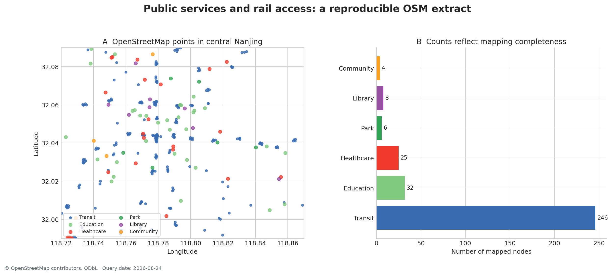

# 南京 OpenStreetMap 公共服务设施 {.unnumbered}

## 数据来源与教学问题 {.unnumbered}

OpenStreetMap（OSM）是一项由全球贡献者持续维护的开放地理数据库。教材通过 Overpass API 查询南京中心城区一个约0.10°×0.15°的范围，提取医院、诊所、学校、幼儿园、图书馆、社区中心、公园以及轨道站点、停靠点和地铁出入口。查询结果共有321个节点，获取日期与完整查询保存在元数据中。

这组数据适合回答一系列逐步加深的问题：公共服务节点如何分类和检查；经纬度数据为何需要投影；社区到轨道节点的最近距离如何计算；点位怎样聚合到网格；OSM 映射密度能否直接代表设施供给。最后一个问题贯穿整页，因为众包地图的记录数量同时受到现实设施分布、制图习惯、贡献者活动和标签规则影响。

## 下载、署名与许可 {.unnumbered}

- [下载南京 OSM 公共服务节点 GeoJSON](../data/china_city_open/nanjing_osm_public_services.geojson)
- [查看查询范围、查询语句和获取日期](../data/china_city_open/metadata.json)
- [OpenStreetMap 版权与署名说明](https://www.openstreetmap.org/copyright)
- [Overpass API 文档](https://wiki.openstreetmap.org/wiki/Overpass_API)

数据依据 Open Data Commons Open Database License（ODbL）1.0 使用。地图、图表和衍生数据库应保留“© OpenStreetMap contributors”署名，并根据使用方式履行 ODbL 要求。教材文件是特定时间与查询条件下的子集，OSM 在线数据库会继续更新。

## 字段字典 {.unnumbered}

| 字段 | 含义 | 示例 |
|---|---|---|
| `osm_type`, `osm_id` | OSM 要素类型与唯一编号 | `node`, `267225237` |
| `name` | `name:zh` 或 `name`；缺名写为“未命名节点” | 南京 |
| `category` | 教材统一的英文分类 | `transit`, `education` |
| `category_zh` | 教材统一的中文分类 | 轨道交通、学校与幼儿园 |
| `amenity` | OSM 原始公共设施标签 | `hospital`, `school` |
| `railway` | OSM 原始铁路标签 | `station`, `subway_entrance` |
| `leisure` | OSM 原始休闲设施标签 | `park` |
| `geometry` | 节点经纬度 | Point |

教材分类没有删除原始标签。分析者可以追溯医院与诊所、学校与幼儿园、车站与地铁出入口的区别，也可以按新的研究问题重新分组。

## 第一步：读取并检查空间范围 {.unnumbered}

```{python filename="notebooks/osm_01_read.py"}
from pathlib import Path

import geopandas as gpd
import pandas as pd

osm = gpd.read_file(
    Path("data/china_city_open/nanjing_osm_public_services.geojson")
)

print(osm.shape)
print(osm.crs)
print(osm.total_bounds)  # minx, miny, maxx, maxy
print(osm.geom_type.value_counts())
```

预期记录数为321，全部为点几何，坐标范围接近118.72°—118.87°E、31.99°—32.09°N。若范围出现在0—1附近或经纬度顺序颠倒，应停止后续距离计算并检查输入格式。

## 第二步：审计分类、缺名与重复 {.unnumbered}

```{python filename="notebooks/osm_02_audit.py"}
# 分类数量同时反映设施分布与OSM映射习惯
category_count = (
    osm.groupby(["category", "category_zh"], dropna=False)
    .size()
    .rename("n")
    .sort_values(ascending=False)
)
print(category_count)

# “未命名节点”来自原始标签缺失，不应误写成真实设施名称
unnamed_share = osm["name"].eq("未命名节点").mean()
print(f"缺名比例：{unnamed_share:.1%}")

# OSM类型与编号共同构成稳定键
duplicate_n = osm.duplicated(["osm_type", "osm_id"]).sum()
assert duplicate_n == 0
```

本次查询中轨道交通节点数量远高于其他类别，原因之一是地铁站可能由多个出入口节点表达。若把每个出入口当成一个独立车站，轨道设施供给会被显著高估。研究“站点数量”时应按 `station`、公共交通关系或站名合并；研究“步行入口可达性”时可以保留出入口节点。

{fig-alt="左图显示南京中心城区OSM公共服务和轨道点位，右图显示各类节点数量，轨道节点最多"}

图A展示节点位置，图B展示类别数量。两幅图首先用于审计：轨道节点沿线成串分布，教育和医疗节点较稀疏，公园节点仅包含以 node 方式表达的记录。大量 OSM 公园以面要素绘制，本查询只提取 node，因此图B中的6个公园不能解释为研究区只有6座公园。

## 第三步：转换到适合距离计算的坐标系 {.unnumbered}

经纬度以角度为单位。南京范围的教学距离分析可转换到 WGS 84 / UTM zone 50N（EPSG:32650），输出单位为米。正式中国项目也可采用符合管理要求的 CGCS2000 投影。

```{python filename="notebooks/osm_03_project.py"}
# to_crs 创建新的几何坐标；原始经纬度数据仍可保留用于共享
osm_m = osm.to_crs(32650)

print(osm_m.crs)
print(osm_m.total_bounds)

# 坐标数量级应接近米制投影，而非118与32附近的经纬度
assert osm_m.geometry.x.mean() > 100_000
```

## 第四步：区分车站与出入口 {.unnumbered}

```{python filename="notebooks/osm_04_transit_units.py"}
transit = osm_m.query("category == 'transit'").copy()

print(transit["railway"].value_counts(dropna=False))

# 入口可达性保留 subway_entrance；站点规模比较可选 station 和 halt
entrances = transit.query("railway == 'subway_entrance'").copy()
stations = transit.query("railway in ['station', 'halt']").copy()

print(f"轨道出入口节点：{len(entrances)}")
print(f"车站或停靠点节点：{len(stations)}")
```

分析单元由问题决定。步行者进入轨道系统时接触的是入口，跨城市比较轨道站规模时通常使用车站。代码中保留两个对象，避免在同一指标中混合两种语义。

## 第五步：计算设施到最近轨道入口的距离 {.unnumbered}

选择医院、诊所、学校、幼儿园、图书馆和社区中心作为服务设施，计算每个设施到最近地铁出入口的直线距离。`sjoin_nearest` 会返回匹配入口和距离；两个图层必须使用同一米制坐标系。

```{python filename="notebooks/osm_05_nearest_transit.py"}
services = osm_m.query(
    "category in ['healthcare', 'education', 'culture', 'community']"
).copy()

nearest = gpd.sjoin_nearest(
    services,
    entrances[["osm_id", "name", "geometry"]],
    how="left",
    distance_col="distance_to_entrance_m",
    lsuffix="service",
    rsuffix="entrance",
)

summary = (
    nearest.groupby("category_zh")["distance_to_entrance_m"]
    .agg(["count", "median", "mean", "max"])
    .round(1)
)
print(summary)
```

这里得到的是点到点欧氏距离，适合快速筛查。街道阻隔、入口朝向、过街设施和道路网络会改变真实步行距离。第11章把同一问题转换为网络最短路径，并比较直线距离与网络距离的系统差异。

## 第六步：用缓冲区检查入口覆盖 {.unnumbered}

```{python filename="notebooks/osm_06_buffer.py"}
# 800米只作为教学阈值，正式研究需说明政策或行为依据
entrance_buffer = entrances[["osm_id", "geometry"]].copy()
entrance_buffer["geometry"] = entrance_buffer.buffer(800)

# unary_union/union_all 合并重叠缓冲区，避免重复计数
coverage = entrance_buffer.geometry.union_all()
services["within_800m"] = services.geometry.within(coverage)

coverage_rate = (
    services.groupby("category_zh")["within_800m"]
    .mean()
    .sort_values(ascending=False)
)
print((coverage_rate * 100).round(1).astype(str) + "%")
```

缓冲区阈值应进行敏感性分析。可以同时计算400、800和1200米覆盖率，观察类别排序是否稳定。若结论只在某一个阈值成立，报告中应展示这一依赖关系。

## 第七步：聚合到社区网格 {.unnumbered}

为了演示点—面关系，可以把真实 OSM 节点连接到南京生成式教学网格。网格只提供统一分析单元，聚合结果描述查询范围内的 OSM 映射记录，不构成官方社区设施清单。

```{python filename="notebooks/osm_07_grid_aggregation.py"}
grid = gpd.read_file("data/nanjing_teaching/community_grid.geojson")

# 点面连接在经纬度下进行拓扑判断；两图层CRS必须一致
osm_grid = gpd.sjoin(
    osm,
    grid[["community_id", "geometry"]],
    how="left",
    predicate="within",
)

counts = (
    osm_grid.dropna(subset=["community_id"])
    .groupby(["community_id", "category"])
    .size()
    .unstack(fill_value=0)
)

grid_counts = grid.merge(counts, on="community_id", how="left")
count_fields = counts.columns.tolist()
grid_counts[count_fields] = grid_counts[count_fields].fillna(0)
```

原始计数受网格面积和类别表达方式影响。若网格面积不一致，可计算每平方千米节点数；若比较人口服务水平，可连接人口后计算每万人设施数。两种标准化回答不同问题，应在字段名中写出分母。

## 第八步：复现 Overpass 查询 {.unnumbered}

```{text filename="queries/nanjing_public_services.overpassql"}
[out:json][timeout:60];
(
  node[amenity~"^(hospital|clinic|school|kindergarten|library|community_centre)$"]
      (31.99,118.72,32.09,118.87);
  node[leisure="park"](31.99,118.72,32.09,118.87);
  node[railway~"^(station|halt|subway_entrance)$"]
      (31.99,118.72,32.09,118.87);
);
out tags;
```

仓库脚本读取标签后，针对缺少坐标的节点通过 OSM API 分批补齐经纬度，最后统一分类并写出 GeoJSON。公共 Overpass 服务可能在高负载时返回超时，脚本包含有限重试；课程集中下载时宜由教师提前生成数据包，减少对公共服务的瞬时压力。

## 进一步研究与数据替换 {.unnumbered}

1. 把查询从 `node` 扩展到 `nwr`，将以面表达的校园、医院和公园转换为代表点或保留多边形。
2. 按站名或公共交通关系合并出入口，比较“入口数”和“车站数”的空间格局。
3. 从北京市、上海市或深圳市公共数据平台获取官方设施清单，与 OSM 记录进行匹配，估计类别覆盖率。
4. 使用 OSMnx 下载步行网络，以设施到入口的网络距离替换直线距离。
5. 记录两个不同日期的查询结果，区分设施变化、标签修改和贡献者补绘。

